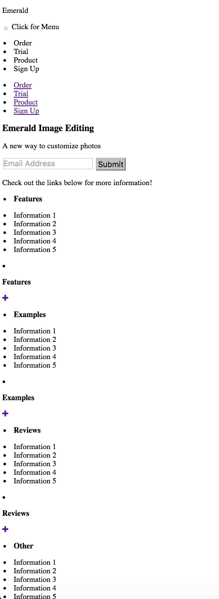
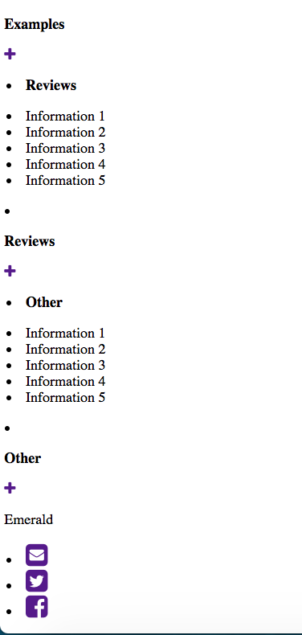
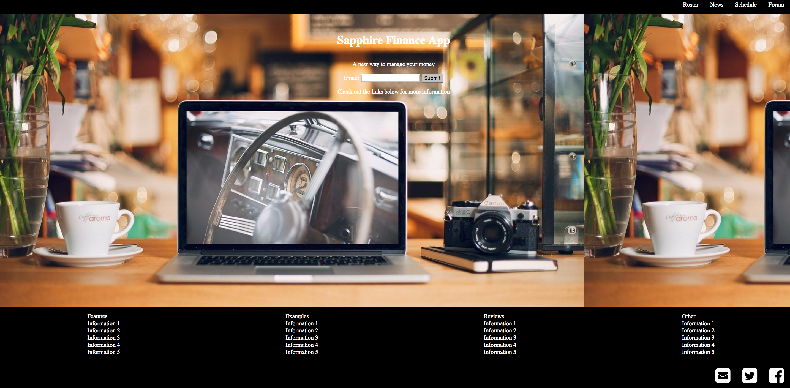
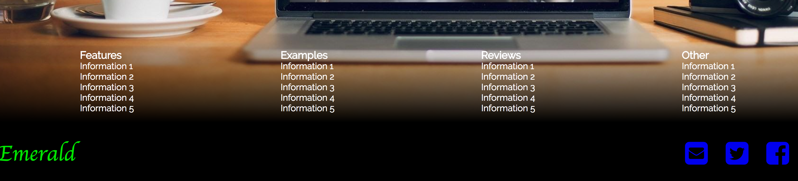

# Anish Chadalavada
Computer Science 52  
Lab Assignment 1  
April 10, 2017

When I first started this lab, I did not take full advantage of the flexbox capabilities, and didn't have a complete understanding of what the flexboxes could be used for and how to set their attributes. Believe it or not, an hour spent playing Flexbox Froggy was immensely helpful on this lab! I realized that I hadn't been using the valuable functionality of flexboxes, so I started from scratch on my CSS even though I was ~80% done. I easily got back to where I was before in an hour of work, and the page was very well structured. The main div (.cover) was a flexbox oriented column-wise and then setting up the layout of the page was very straightforward and painless. I will definitely be using flexboxes whenever I can from here on out.

The page was resizing abysmally at first, but when I appropriately used flexboxes, it resized much better.

One thing I plan on incorporating in my lab is a better organizational structure for my CSS code. I have a tendency to work from the top down, adding styling as the page needs it. Even though the page is very well structured, the CSS code doesn't always reflect that, and I need to be cognizant of this and organize my CSS code better for ease of editing and access. I really enjoyed this lab assignment overall!

I did do the checkbox hack based on guidelines from a website where I read about using CSS to respond to clicks (citation in code and below). However, I do appreciate JQuery and Javascript functionality as it seemed a bit odd using this method - it is clear CSS is not meant for this functionality. Screenshots of my lab are below! Some of these screenshots are from before I made significant overall updates, although the final ones are for my final product.

NOTE: My CSS sheet is title Style2.css because I redid it to incorporate flexboxes appropriately. The original CSS sheet style.css is also in my repo but is not linked or used (you can see my use of flexboxes and styling is not quite as good in that older one)

HTML Bare Bones...
(Taken by removing CSS stylesheet since I changed the whole page and forgot to retake HTML screenshots)

Basic CSS and basic flexboxes (Changed name from Sapphire to Emerald and changed a bit of the theme later on)

Final product (Full browser width)

Final product (narrow browser version)

Citations (contained inline with code):

https://www.w3schools.com/colors/colors_picker.asp  
https://css-tricks.com/snippets/css/a-guide-to-flexbox/  
https://www.w3schools.com/css/css3_buttons.asp  
https://www.w3schools.com/cssref/css3_pr_border-radius.asp  
https://developer.mozilla.org/en-US/docs/Web/CSS/linear-gradient  
http://tutorialzine.com/2015/08/quick-tip-css-only-dropdowns-with-the-checkbox-hack  
https://www.w3schools.com/tags/tag_nav.asp  
https://www.w3schools.com/html/html_form_input_types.asp  
https://www.w3schools.com/css/css_howto.asp  
https://www.w3schools.com/css/css_syntax.asp  
https://www.w3schools.com/html/html_images.asp  
http://fontawesome.io/examples/  
